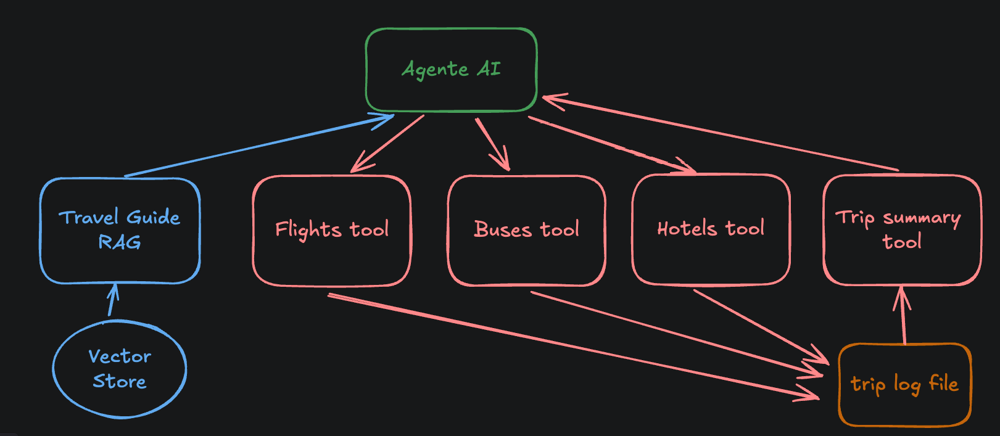

# Asistente de Viajes - Segundo Parcial - Topicos IA 2024

Este repositorio contiene el código base para la 2da evaluacion parcial. El proyecto trata de un 
agente AI para la gestión y planificación de viajes de turismo. El agente tiene acceso a 
distintas fuentes de información sobre atracciones turísticas bolivianas (Travel guide), y a otras herramientas
para poder planificar y gestionar un viaje de turismo.

Su objetivo es completar la implementación del agente agregando las funcionalidades faltantes. Además también
deberá completar las interfaces del proyecto para ser integrado en un sistema como API REST y como 
chatbot.

## Arquitectura del sistema



En el gráfico, se muestra la arquitectura del sistema, la descripción de los componentes es la siguiente:

 - Agente AI: Es el agente de AI principal, que interactúa con el usuario a través de una interfaz de chat o a través de una API REST.
 - Travel Guide RAG: Es un sistema RAG que puede realizar consultas a información de viajes sobre Bolivia. Este sistema se usará para dar información útil y recomendaciones al usuario.
 - Restaurants tool: Una herramienta que simula la reserva de una mesa en un restaurante.
 - Flights tool: Una herramienta que simula la compra de pasajes de avión.
 - Buses tool: Una herramienta que simula la compra de pasajes de bus.
 - Hotels tool: Una herramienta que simula la reserva de habitaciones de hotel.
 - Trip summary tool: Una herramienta que devuelve un resumen detallado de todas las actividades reservadas en el viaje.

Las herramientas de reserva (flights, buses, hotels, restaurants) también escriben los datos a un archivo json de logs (trip.json) 
que será un registro de todas las actividades que se reserven para el viaje.

La herramienta de Trip Summary deberá usar los datos del trip.json para crear un resumen y reporte detallado del viaje basado en las actividades guardadas.

## Instrucciones

Usted deberá completar la funcionalidad del sistema y luego implementar características importantes para el funcionamiento correcto del proyecto.

### Completado de herramientas

Se tiene una herramienta implementada como ejemplo: `flight_tool` que usa la función `reserve_flight`, usted debe completar la implementación de las herramientas restantes: bus_tool, hotel_tool y restaurant_tool. Luego de completar las herramientas, deberá hacerlas disponibles al agente para su uso.

### Implementación de una API

Deberá implementar los endpoint de una api que haga uso del agente. Existe un endpoint de ejemplo para obtener recomendaciones de ciudades a visitar basado en algunas notas. Los endpoints a implementar son:
 - Recomendaciones de lugares en una ciudad determinada: Dada la ciudad, recomendar lugares para visitar basado en algunas notas, la lista de notas es opcional.
 - Recomendaciones de hoteles: Dada la ciudad, recomendar hoteles donde alojarse. Notas opcionales.
 - Recomendaciones de actividades: Dada la ciudad, recomendar actividades interesantes que realizar. Notas opcionales.
 - Reservar Vuelos: Endpoint para reservar un vuelo dados los siguientes parámetros: origen, destino, fecha.
 - Reservar Bus: Endpoint para reservar un ticket de bus dados los siguientes parámetros: origen, destino, fecha.
 - Reservar Hotel: Endpoint para reservar un cuarto de hotel dados los parametros: fecha inicio, fecha fin, hotel, ciudad.
 - Reservar Restaurante: Enpoint para reservar una mesa de restaurante dados los siguientes parametros: fecha, hora, restaurante, ciudad.
 - Reporte de viaje: Este endpoint deberá generar un reporte detallado del viaje en base al archivo de log de actividades. En el reporte deberá incluir todas las actividades organizadas por lugar y fecha, además de un resumen del presupuesto total y comentarios sobre los lugares y actividades a realizarse.

Los endpoints de reserva no necesitan usar al agente AI para ejecutarse, usted puede usar las funciones de reserva directamente.

Los endpoints de recomendaciones y reporte de viaje deberán usar el agente y/o un LLM obligatoriamente.

#### Ejecucion local
Para correr la api localmente, se ha creado una configuración de depuración en el archivo `.vscode/launch.json` que puede usar con el depurador de VSCode. Alternativamente usted puede usar el comando:
```
fastapi dev ai_assistant/api.py
```

### Implementación y Refinación de prompts
Usted deberá implementar los prompts de descripción de las herramientas de forma detallada para que el agenta pueda hacer uso de las mismas. Incluya en la descripción la utilidad, funcionalidades, parámetros de entrada y de salida.

Deberá refinar los prompts disponibles para el sistema según vea conveniente. Comente las modificaciones en los archivos de código correspondiente: `ai_assistant/prompts.py`.
El objetivo será hacer la ejecución del sistema lo más robusta posible.

### Pruebas en chatbot

Se ha disponibilizado una interfaz de chatbot de ejemplo para hacer las pruebas correspondientes con el agente. Usted podrá probar
las funcionalidades de query engine y de uso de herramientas de forma local. Si usted usa vscode, existe un archivo de configuración para correr el depurador directamente en la aplicación de Gradio (`.vscode/launch.json`). Usted puede utilizar esta configuración para correr y depurar el programa. También puede correr la interfaz desde la línea de comandos usando el comando:

```
python -m ai_assistant.chatbot
```

### Ejemplo de trip.json

```json
[
    {
        "trip_type": "FLIGHT",
        "date": "2023-12-05",
        "departure": "Oruro",
        "destination": "Cochabamba",
        "cost": 554,
        "reservation_type": "TripReservation"
    },
    {
        "checkin_date": "2023-12-05",
        "checkout_date": "2023-12-15",
        "hotel_name": "El Lucero",
        "city": "Oruro",
        "cost": 990,
        "reservation_type": "HotelReservation"
    },
    {
        "reservation_time": "2023-12-07T20:00:00",
        "restaurant": "Gustu",
        "city": "La Paz",
        "dish": "not specified",
        "cost": 29,
        "reservation_type": "RestaurantReservation"
    },
    {
        "trip_type": "FLIGHT",
        "date": "2024-01-02",
        "departure": "Cochabamba",
        "destination": "Dallas",
        "cost": 401,
        "reservation_type": "TripReservation"
    }
]
```

## Parámetros de evaluación
Para este trabajo se evaluarán los siguientes aspectos:

 - **Completitud**: El código debe estar completo y funcional.
 - **Calidad de código**: El código deberá seguir las buenas prácticas de programación exploradas en clase.
 - **Funcionamiento robusto**: El sistema deberá responder de forma robusta a distintos tipos de consulta, ya sea de información, recomendación, reserva de actividades y el resumen del viaje. Deberá evitar alucinaciones e información falsa a toda costa.

